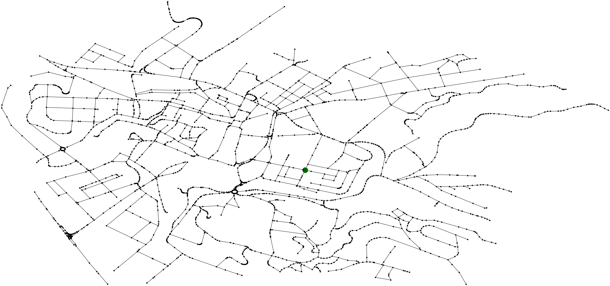

# rb-mapper

## Usage

```sh
ruby osm_simple_nav.rb
```

## Example commands and their outputs


```sh
ruby osm_simple_nav.rb --load-undir data/near_ucl.osm --export results/near_ucl-undir.png
```


```sh
ruby osm_simple_nav.rb --load-dir data/near_ucl.osm --export results/near_ucl-dir.png
```


```sh
ruby osm_simple_nav.rb --load-undir-comp data/near_ucl.osm --export results/near_ucl-undir-comp.png
```


```sh
ruby osm_simple_nav.rb --load-dir-comp data/near_ucl.osm --export results/near_ucl-dir-comp.png
```


```sh
ruby osm_simple_nav.rb --load-dir-comp data/near_ucl.osm --show-nodes > results/near_ucl-nodes.log
```

[near_ucl-nodes.log](./results/near_ucl-nodes.log)

```sh
ruby osm_simple_nav.rb --load-dir-comp data/near_ucl.osm --show-nodes 1131753268 1676873900 results/near_ucl-nodes-id.png
```


```sh
ruby osm_simple_nav.rb --load-dir-comp data/near_ucl.osm --show-nodes 50.0885031 14.4578361 50.0889619 14.4661806 results/near_ucl-nodes-latlon.png
```


```sh
ruby osm_simple_nav.rb --load-undir-comp data/near_ucl.osm --midist-len 1131753268 1676873900 results/near_ucl-undir-midist-len-id.png
```


```sh
ruby osm_simple_nav.rb --load-undir-comp data/near_ucl.osm --midist-len 50.0885031 14.4578361 50.0889619 14.4661806 results/near_ucl-undir-midist-len-latlon.png
```


```sh
ruby osm_simple_nav.rb --load-undir-comp data/near_ucl.osm --midist-time 1131753268 1676873900 results/near_ucl-undir-midist-time-id.png
```


```sh
ruby osm_simple_nav.rb --load-undir-comp data/near_ucl.osm --midist-time 50.0885031 14.4578361 50.0889619 14.4661806 results/near_ucl-undir-midist-time-latlon.png
```


```sh
ruby osm_simple_nav.rb --load-dir-comp data/near_ucl.osm --midist-len 1131753268 1676873900 results/near_ucl-dir-midist-len-id.png
```


```sh
ruby osm_simple_nav.rb --load-dir-comp data/near_ucl.osm --midist-len 50.0885031 14.4578361 50.0889619 14.4661806 results/near_ucl-dir-midist-len-latlon.png
```


```sh
ruby osm_simple_nav.rb --load-dir-comp data/near_ucl.osm --midist-time 1131753268 1676873900 results/near_ucl-dir-midist-time-id.png
```


```sh
ruby osm_simple_nav.rb --load-dir-comp data/near_ucl.osm --midist-time 50.0885031 14.4578361 50.0889619 14.4661806 results/near_ucl-dir-midist-time-latlon.png
```


```sh
ruby osm_simple_nav.rb --load-undir-comp data/near_ucl.osm --center results/near_ucl-center.png
```


---


```sh
ruby osm_simple_nav.rb --load-undir data/far_from_ucl.osm --export results/far_from_ucl-undir.png
```


```sh
ruby osm_simple_nav.rb --load-dir data/far_from_ucl.osm --export results/far_from_ucl-dir.png
```


```sh
ruby osm_simple_nav.rb --load-undir-comp data/far_from_ucl.osm --export results/far_from_ucl-undir-comp.png
```


```sh
ruby osm_simple_nav.rb --load-dir-comp data/far_from_ucl.osm --export results/far_from_ucl-dir-comp.png
```


```sh
ruby osm_simple_nav.rb --load-dir-comp data/far_from_ucl.osm --show-nodes > results/far_from_ucl-nodes.log
```

[far_from_ucl-nodes.log](./results/far_from_ucl-nodes.log)

```sh
ruby osm_simple_nav.rb --load-dir-comp data/far_from_ucl.osm --show-nodes 305809335 3374602615 results/far_from_ucl-nodes-id.png
```


```sh
ruby osm_simple_nav.rb --load-dir-comp data/far_from_ucl.osm --show-nodes 50.0869550 14.4438981 50.0803644 14.4647322 results/far_from_ucl-nodes-latlon.png
```


```sh
ruby osm_simple_nav.rb --load-undir-comp data/far_from_ucl.osm --midist-len 305809335 3374602615 results/far_from_ucl-undir-midist-len-id.png
```


```sh
ruby osm_simple_nav.rb --load-undir-comp data/far_from_ucl.osm --midist-len 50.0869550 14.4438981 50.0803644 14.4647322 results/far_from_ucl-undir-midist-len-latlon.png
```


```sh
ruby osm_simple_nav.rb --load-undir-comp data/far_from_ucl.osm --midist-time 305809335 3374602615 results/far_from_ucl-undir-midist-time-id.png
```


```sh
ruby osm_simple_nav.rb --load-undir-comp data/far_from_ucl.osm --midist-time 50.0869550 14.4438981 50.0803644 14.4647322 results/far_from_ucl-undir-midist-time-latlon.png
```


```sh
ruby osm_simple_nav.rb --load-dir-comp data/far_from_ucl.osm --midist-len 305809335 3374602615 results/far_from_ucl-dir-midist-len-id.png
```


```sh
ruby osm_simple_nav.rb --load-dir-comp data/far_from_ucl.osm --midist-len 50.0869550 14.4438981 50.0803644 14.4647322 results/far_from_ucl-dir-midist-len-latlon.png
```


```sh
ruby osm_simple_nav.rb --load-dir-comp data/far_from_ucl.osm --midist-time 305809335 3374602615 results/far_from_ucl-dir-midist-time-id.png
```


```sh
ruby osm_simple_nav.rb --load-dir-comp data/far_from_ucl.osm --midist-time 50.0869550 14.4438981 50.0803644 14.4647322 results/far_from_ucl-dir-midist-time-latlon.png
```


```sh
ruby osm_simple_nav.rb --load-undir-comp data/far_from_ucl.osm --center results/far_from_ucl-center.png
```


---


```sh
ruby osm_simple_nav.rb --load-undir data/old_town.osm --export results/old_town-undir.png
```


```sh
ruby osm_simple_nav.rb --load-dir data/old_town.osm --export results/old_town-dir.png
```


```sh
ruby osm_simple_nav.rb --load-undir-comp data/old_town.osm --export results/old_town-undir-comp.png
```


```sh
ruby osm_simple_nav.rb --load-dir-comp data/old_town.osm --export results/old_town-dir-comp.png
```


```sh
ruby osm_simple_nav.rb --load-dir-comp data/old_town.osm --show-nodes > results/old_town-nodes.log
```

[old_town-nodes.log](./results/old_town-nodes.log)

```sh
ruby osm_simple_nav.rb --load-dir-comp data/old_town.osm --show-nodes 431313108 282553733 results/old_town-nodes-id.png
```


```sh
ruby osm_simple_nav.rb --load-dir-comp data/old_town.osm --show-nodes 50.0855803 14.4339222 50.0884781 14.4287986 results/old_town-nodes-latlon.png
```


```sh
ruby osm_simple_nav.rb --load-undir-comp data/old_town.osm --midist-len 431313108 282553733 results/old_town-undir-midist-len-id.png
```


```sh
ruby osm_simple_nav.rb --load-undir-comp data/old_town.osm --midist-len 50.0855803 14.4339222 50.0884781 14.4287986 results/old_town-undir-midist-len-latlon.png
```


```sh
ruby osm_simple_nav.rb --load-undir-comp data/old_town.osm --midist-time 431313108 282553733 results/old_town-undir-midist-time-id.png
```


```sh
ruby osm_simple_nav.rb --load-undir-comp data/old_town.osm --midist-time 50.0855803 14.4339222 50.0884781 14.4287986 results/old_town-undir-midist-time-latlon.png
```


```sh
ruby osm_simple_nav.rb --load-dir-comp data/old_town.osm --midist-len 431313108 282553733 results/old_town-dir-midist-len-id.png
```


```sh
ruby osm_simple_nav.rb --load-dir-comp data/old_town.osm --midist-len 50.0855803 14.4339222 50.0884781 14.4287986 results/old_town-dir-midist-len-latlon.png
```


```sh
ruby osm_simple_nav.rb --load-dir-comp data/old_town.osm --midist-time 431313108 282553733 results/old_town-dir-midist-time-id.png
```


```sh
ruby osm_simple_nav.rb --load-dir-comp data/old_town.osm --midist-time 50.0855803 14.4339222 50.0884781 14.4287986 results/old_town-dir-midist-time-latlon.png
```


```sh
ruby osm_simple_nav.rb --load-undir-comp data/old_town.osm --center results/old_town-center.png
```


---


```sh
ruby osm_simple_nav.rb --load-undir data/namesti.osm --export results/namesti-undir.png
```


```sh
ruby osm_simple_nav.rb --load-dir data/namesti.osm --export results/namesti-dir.png
```


```sh
ruby osm_simple_nav.rb --load-undir-comp data/namesti.osm --export results/namesti-undir-comp.png
```


```sh
ruby osm_simple_nav.rb --load-dir-comp data/namesti.osm --export results/namesti-dir-comp.png
```


```sh
ruby osm_simple_nav.rb --load-dir-comp data/namesti.osm --show-nodes > results/namesti-nodes.log
```

[namesti-nodes.log](./results/namesti-nodes.log)

```sh
ruby osm_simple_nav.rb --load-dir-comp data/namesti.osm --show-nodes 4720250018 2425845592 results/namesti-nodes-id.png
```


```sh
ruby osm_simple_nav.rb --load-dir-comp data/namesti.osm --show-nodes 50.7656083 15.0603456 50.7664231 15.0628253 results/namesti-nodes-latlon.png
```


```sh
ruby osm_simple_nav.rb --load-undir-comp data/namesti.osm --midist-len 4720250018 2425845592 results/namesti-undir-midist-len-id.png
```


```sh
ruby osm_simple_nav.rb --load-undir-comp data/namesti.osm --midist-len 50.7656083 15.0603456 50.7664231 15.0628253 results/namesti-undir-midist-len-latlon.png
```


```sh
ruby osm_simple_nav.rb --load-undir-comp data/namesti.osm --midist-time 4720250018 2425845592 results/namesti-undir-midist-time-id.png
```


```sh
ruby osm_simple_nav.rb --load-undir-comp data/namesti.osm --midist-time 50.7656083 15.0603456 50.7664231 15.0628253 results/namesti-undir-midist-time-latlon.png
```


```sh
ruby osm_simple_nav.rb --load-dir-comp data/namesti.osm --midist-len 4720250018 2425845592 results/namesti-dir-midist-len-id.png
```


```sh
ruby osm_simple_nav.rb --load-dir-comp data/namesti.osm --midist-len 50.7656083 15.0603456 50.7664231 15.0628253 results/namesti-dir-midist-len-latlon.png
```


```sh
ruby osm_simple_nav.rb --load-dir-comp data/namesti.osm --midist-time 4720250018 2425845592 results/namesti-dir-midist-time-id.png
```


```sh
ruby osm_simple_nav.rb --load-dir-comp data/namesti.osm --midist-time 50.7656083 15.0603456 50.7664231 15.0628253 results/namesti-dir-midist-time-latlon.png
```


```sh
ruby osm_simple_nav.rb --load-undir-comp data/namesti.osm --center results/namesti-center.png
```


---


```sh
ruby osm_simple_nav.rb --load-undir data/kristianov.osm --export results/kristianov-undir.png
```


```sh
ruby osm_simple_nav.rb --load-dir data/kristianov.osm --export results/kristianov-dir.png
```


```sh
ruby osm_simple_nav.rb --load-undir-comp data/kristianov.osm --export results/kristianov-undir-comp.png
```


```sh
ruby osm_simple_nav.rb --load-dir-comp data/kristianov.osm --export results/kristianov-dir-comp.png
```


```sh
ruby osm_simple_nav.rb --load-dir-comp data/kristianov.osm --show-nodes > results/kristianov-nodes.log
```

[kristianov-nodes.log](./results/kristianov-nodes.log)

```sh
ruby osm_simple_nav.rb --load-dir-comp data/kristianov.osm --show-nodes 3952848953 1962574109 results/kristianov-nodes-id.png
```


```sh
ruby osm_simple_nav.rb --load-dir-comp data/kristianov.osm --show-nodes 50.7649064 15.0650967 50.7710381 15.0682944 results/kristianov-nodes-latlon.png
```


```sh
ruby osm_simple_nav.rb --load-undir-comp data/kristianov.osm --midist-len 3952848953 1962574109 results/kristianov-undir-midist-len-id.png
```


```sh
ruby osm_simple_nav.rb --load-undir-comp data/kristianov.osm --midist-len 50.7649064 15.0650967 50.7710381 15.0682944 results/kristianov-undir-midist-len-latlon.png
```


```sh
ruby osm_simple_nav.rb --load-undir-comp data/kristianov.osm --midist-time 3952848953 1962574109 results/kristianov-undir-midist-time-id.png
```


```sh
ruby osm_simple_nav.rb --load-undir-comp data/kristianov.osm --midist-time 50.7649064 15.0650967 50.7710381 15.0682944 results/kristianov-undir-midist-time-latlon.png
```


```sh
ruby osm_simple_nav.rb --load-dir-comp data/kristianov.osm --midist-len 3952848953 1962574109 results/kristianov-dir-midist-len-id.png
```


```sh
ruby osm_simple_nav.rb --load-dir-comp data/kristianov.osm --midist-len 50.7649064 15.0650967 50.7710381 15.0682944 results/kristianov-dir-midist-len-latlon.png
```


```sh
ruby osm_simple_nav.rb --load-dir-comp data/kristianov.osm --midist-time 3952848953 1962574109 results/kristianov-dir-midist-time-id.png
```


```sh
ruby osm_simple_nav.rb --load-dir-comp data/kristianov.osm --midist-time 50.7649064 15.0650967 50.7710381 15.0682944 results/kristianov-dir-midist-time-latlon.png
```


```sh
ruby osm_simple_nav.rb --load-undir-comp data/kristianov.osm --center results/kristianov-center.png
```


---


```sh
ruby osm_simple_nav.rb --load-undir data/papirak.osm --export results/papirak-undir.png
```


```sh
ruby osm_simple_nav.rb --load-dir data/papirak.osm --export results/papirak-dir.png
```


```sh
ruby osm_simple_nav.rb --load-undir-comp data/papirak.osm --export results/papirak-undir-comp.png
```


```sh
ruby osm_simple_nav.rb --load-dir-comp data/papirak.osm --export results/papirak-dir-comp.png
```


```sh
ruby osm_simple_nav.rb --load-dir-comp data/papirak.osm --show-nodes > results/papirak-nodes.log
```

[papirak-nodes.log](./results/papirak-nodes.log)

```sh
ruby osm_simple_nav.rb --load-dir-comp data/papirak.osm --show-nodes 1288250134 280899403 results/papirak-nodes-id.png
```


```sh
ruby osm_simple_nav.rb --load-dir-comp data/papirak.osm --show-nodes 50.7679864 15.0542239 50.7692983 15.0543547 results/papirak-nodes-latlon.png
```


```sh
ruby osm_simple_nav.rb --load-undir-comp data/papirak.osm --midist-len 1288250134 280899403 results/papirak-undir-midist-len-id.png
```


```sh
ruby osm_simple_nav.rb --load-undir-comp data/papirak.osm --midist-len 50.7679864 15.0542239 50.7692983 15.0543547 results/papirak-undir-midist-len-latlon.png
```


```sh
ruby osm_simple_nav.rb --load-undir-comp data/papirak.osm --midist-time 1288250134 280899403 results/papirak-undir-midist-time-id.png
```


```sh
ruby osm_simple_nav.rb --load-undir-comp data/papirak.osm --midist-time 50.7679864 15.0542239 50.7692983 15.0543547 results/papirak-undir-midist-time-latlon.png
```


```sh
ruby osm_simple_nav.rb --load-dir-comp data/papirak.osm --midist-len 1288250134 280899403 results/papirak-dir-midist-len-id.png
```


```sh
ruby osm_simple_nav.rb --load-dir-comp data/papirak.osm --midist-len 50.7679864 15.0542239 50.7692983 15.0543547 results/papirak-dir-midist-len-latlon.png
```


```sh
ruby osm_simple_nav.rb --load-dir-comp data/papirak.osm --midist-time 1288250134 280899403 results/papirak-dir-midist-time-id.png
```


```sh
ruby osm_simple_nav.rb --load-dir-comp data/papirak.osm --midist-time 50.7679864 15.0542239 50.7692983 15.0543547 results/papirak-dir-midist-time-latlon.png
```


```sh
ruby osm_simple_nav.rb --load-undir-comp data/papirak.osm --center results/papirak-center.png
```


---


```sh
ruby osm_simple_nav.rb --load-undir data/centrum.osm --export results/centrum-undir.png
```


```sh
ruby osm_simple_nav.rb --load-dir data/centrum.osm --export results/centrum-dir.png
```


```sh
ruby osm_simple_nav.rb --load-undir-comp data/centrum.osm --export results/centrum-undir-comp.png
```


```sh
ruby osm_simple_nav.rb --load-dir-comp data/centrum.osm --export results/centrum-dir-comp.png
```


```sh
ruby osm_simple_nav.rb --load-dir-comp data/centrum.osm --show-nodes > results/centrum-nodes.log
```

[centrum-nodes.log](./results/centrum-nodes.log)

```sh
ruby osm_simple_nav.rb --load-dir-comp data/centrum.osm --show-nodes 280899305 611858574 results/centrum-nodes-id.png
```


```sh
ruby osm_simple_nav.rb --load-dir-comp data/centrum.osm --show-nodes 50.7727206 15.0667369 50.7707717 15.0494336 results/centrum-nodes-latlon.png
```


```sh
ruby osm_simple_nav.rb --load-undir-comp data/centrum.osm --midist-len 280899305 611858574 results/centrum-undir-midist-len-id.png
```


```sh
ruby osm_simple_nav.rb --load-undir-comp data/centrum.osm --midist-len 50.7727206 15.0667369 50.7707717 15.0494336 results/centrum-undir-midist-len-latlon.png
```


```sh
ruby osm_simple_nav.rb --load-undir-comp data/centrum.osm --midist-time 280899305 611858574 results/centrum-undir-midist-time-id.png
```


```sh
ruby osm_simple_nav.rb --load-undir-comp data/centrum.osm --midist-time 50.7727206 15.0667369 50.7707717 15.0494336 results/centrum-undir-midist-time-latlon.png
```


```sh
ruby osm_simple_nav.rb --load-dir-comp data/centrum.osm --midist-len 280899305 611858574 results/centrum-dir-midist-len-id.png
```


```sh
ruby osm_simple_nav.rb --load-dir-comp data/centrum.osm --midist-len 50.7727206 15.0667369 50.7707717 15.0494336 results/centrum-dir-midist-len-latlon.png
```


```sh
ruby osm_simple_nav.rb --load-dir-comp data/centrum.osm --midist-time 280899305 611858574 results/centrum-dir-midist-time-id.png
```


```sh
ruby osm_simple_nav.rb --load-dir-comp data/centrum.osm --midist-time 50.7727206 15.0667369 50.7707717 15.0494336 results/centrum-dir-midist-time-latlon.png
```


```sh
ruby osm_simple_nav.rb --load-undir-comp data/centrum.osm --center results/centrum-center.png
```


